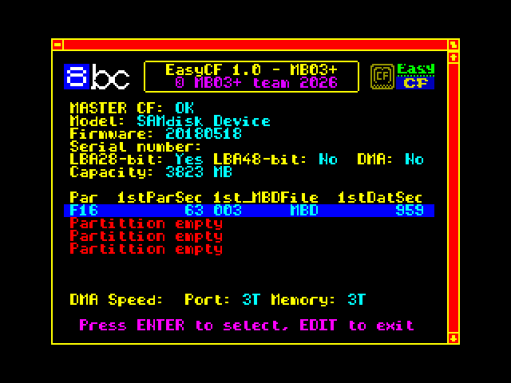

# EasyCF 1.0

EasyCF 1.0 is the first public release of EasyCF for BSDOS and MB03+.

EasyCF automatically detects supported FAT16/FAT32 partitions on a CompactFlash card, locates MBD/MBH disk images and configures BSDOS without requiring the user to know their physical sector location.

## Supported hardware

- MB03+

## Main features

- CompactFlash access through the ATA/IDE interface
- FAT16 and FAT32 support
- up to four primary partitions
- superfloppy FAT16/FAT32 media support
- automatic and manual partition selection
- SPACE override for temporary MANUAL mode
- BSDOS disks 1–255
- MBD and MBH image support
- automatic calculation of the physical LBA of the first BSDOS disk
- per-disk write protection
- FAT32 root-directory preparation tools for Windows and Linux

## Downloads

### Complete package

[**Download EasyCF v1.0 ZIP**](https://github.com/milan-stava/EasyCF/releases/download/v1.0/EasyCF_v1.0.zip)

### Individual files

- [EasyCF_MB_BIN.tap](https://github.com/milan-stava/EasyCF/releases/download/v1.0/EasyCF_MB_BIN.tap) – EasyCF for MB03+
- [EasyCF_documentation.txt](https://github.com/milan-stava/EasyCF/releases/download/v1.0/EasyCF_documentation.txt) – complete manual
- [PREPARE_EASY_FAT32.bat](https://github.com/milan-stava/EasyCF/releases/download/v1.0/PREPARE_EASY_FAT32.bat) – Windows FAT32 preparation tool
- [PREPARE_EASY_FAT32.sh](https://github.com/milan-stava/EasyCF/releases/download/v1.0/PREPARE_EASY_FAT32.sh) – Linux FAT32 preparation tool

See the [EasyCF 1.0 release](https://github.com/milan-stava/EasyCF/releases/tag/v1.0) for release notes.

## Important

MBD/MBH disk images must form one physically contiguous area on the media.

Version 1.0 has been tested on real MB03+ hardware, including BSDOS read and write operations.

## Documentation

See `EasyCF_documentation.txt` for the complete user and technical manual.

## Related project

EasySD is the SD-card counterpart of EasyCF.

## Official website

Full HTML documentation, screenshots and project information:

- [English documentation](https://hood.speccy.cz/dwnld/EasySD_CF_infoEN.html)
- [Czech documentation](https://hood.speccy.cz/dwnld/EasySD_CF_infoCZ.html)
- [German documentation](https://hood.speccy.cz/dwnld/EasySD_CF_infoDE.html)
