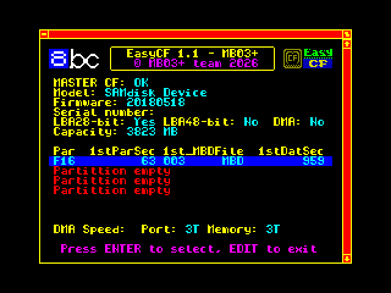
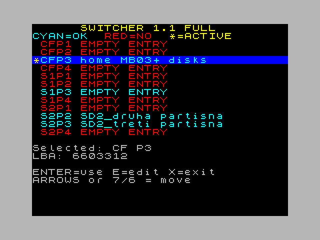

# EasyCF

EasyCF is a BSDOS utility for the ZX Spectrum with **MB03+**. It automatically finds BSDOS disk images stored on a CompactFlash card and configures BSDOS without requiring the user to know or calculate their physical sector locations.

EasyCF works with **MBD** and **MBH** disk images stored on **FAT16** or **FAT32** media. It supports up to four primary partitions as well as FAT16/FAT32 superfloppy media.

EasySD is the SD-card counterpart of EasyCF. Starting with version 1.1, both projects can form one shared system on a full MB03+, allowing live switching between **CF, SD1 and SD2** without restarting BSDOS or losing the contents of normal RAM.

  
  

## Main features

- CompactFlash access through the MB03+ ATA/IDE interface
- FAT16 and FAT32 support
- up to four primary partitions
- FAT16/FAT32 superfloppy support
- MBD and MBH disk-image support
- BSDOS disks 1–255
- automatic calculation of the physical LBA of the BSDOS disk area
- automatic or manual partition selection
- temporary MANUAL mode by holding SPACE during startup
- per-disk write protection
- operation with large FAT16/FAT32 media and high absolute LBAs

**Important:** MBD/MBH disk images must form one physically contiguous area on the medium.

## What's new

### Version 1.0.1

- added `EasyCF_EL.tap` for launching EasyCF from ESXDOS
- `EasyCF_EL.tap` can be started on MB03+ through DivIDE/DivMMC
- EasyCF can also be launched from eLeMeNt ZX when an external MB03+ with a CompactFlash card is connected
- updated build system and documentation

### Version 1.1

EasyCF 1.1 keeps the CompactFlash handling of version 1.0.1 and adds the common interface used by the EasySD/EasyCF 1.1 system.

- shared runtime switching between **CF, SD1 and SD2**
- switching without restarting BSDOS and without losing normal RAM contents
- active device shown in the BSDOS catalogue as `CF`, `S1` or `S2`
- active partition shown as `P1`–`P4`
- **Basic Switcher 1.0** switches complete CF / SD1 / SD2 devices
- **FULL Switcher 1.1** additionally selects individual partitions P1–P4
- FULL Switcher 1.1 allows a **26-character user-defined name** for every valid partition
- partition names are displayed on the first line of the BSDOS catalogue
- EasyCF 1.1 preserves valid VDT partition names during reinstallation when the old and newly detected records are valid and their full 4-byte LBA values match
- unavailable devices and invalid partitions are not activated

For combined EasyCF + EasySD 1.1 operation on MB03+, install **EasyCF 1.1 first** and **EasySD 1.1 afterwards**.

The complete CF/SD1/SD2 switching system in version 1.1 is intended for the **full MB03+**.

## Downloads

### EasyCF 1.1

Current EasyCF 1.1 files from the `main` branch:

- [**EasyCF_MB.tap**](https://github.com/milan-stava/EasyCF/raw/main/ver%201.1/EasyCF_MB.tap) – EasyCF 1.1 for MB03+
- [**EasyCF_EL.tap**](https://github.com/milan-stava/EasyCF/raw/main/ver%201.1/EasyCF_EL.tap) – ESXDOS bootstrap for MB03+, and for eLeMeNt ZX with an external MB03+ and CF card

[Browse the complete EasyCF 1.1 directory](https://github.com/milan-stava/EasyCF/tree/main/ver%201.1)

### EasyCF 1.0.1

Version 1.0.1 remains available as the previous stable generation:

- [**EasyCF_MB.tap**](https://github.com/milan-stava/EasyCF/raw/main/ver%201.0.1/EasyCF_MB.tap) – EasyCF for MB03+
- [**EasyCF_EL.tap**](https://github.com/milan-stava/EasyCF/raw/main/ver%201.0.1/EasyCF_EL.tap) – ESXDOS bootstrap for MB03+, and for eLeMeNt ZX with an external MB03+ and CF card

[EasyCF 1.0.1 release](https://github.com/milan-stava/EasyCF/releases/tag/v1.0.1)  
[Browse the complete EasyCF 1.0.1 directory](https://github.com/milan-stava/EasyCF/tree/main/ver%201.0.1)

## Hardware

EasyCF requires the CompactFlash interface provided by **MB03+**.

- **MB03+** – directly supported
- **eLeMeNt ZX + external MB03+** – EasyCF can be launched through `EasyCF_EL.tap`; the CF interface is still provided by MB03+
- **MB03+ Slim** – no standalone EasyCF variant, because MB03+ Slim does not contain the required CF interface

## Related project

[**EasySD**](https://github.com/milan-stava/EasySD) is the SD-card counterpart of EasyCF.

On a full MB03+, EasySD 1.1 adds support for both SD slots and completes the shared EasyCF / SD1 / SD2 switching system.

## Documentation

The complete EasySD / EasyCF 1.1 user and technical manual is available in three languages:

- [English documentation](https://hood.speccy.cz/dwnld/EasySD_CF_infoEN.html)
- [Czech documentation](https://hood.speccy.cz/dwnld/EasySD_CF_infoCZ.html)
- [German documentation](https://hood.speccy.cz/dwnld/EasySD_CF_infoDE.html)

## Building from source

The repository contains the complete source code and build scripts for the archived public versions.

Windows builds use `compile.bat`; Linux builds use `compile.sh` where available.

---

EasyCF is an unofficial community project for BSDOS / MB03+.
